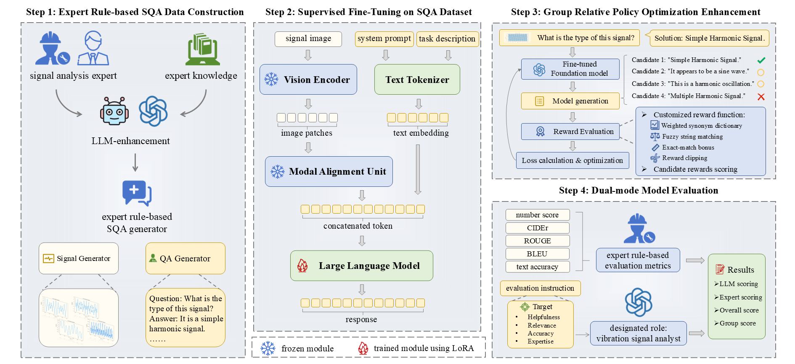
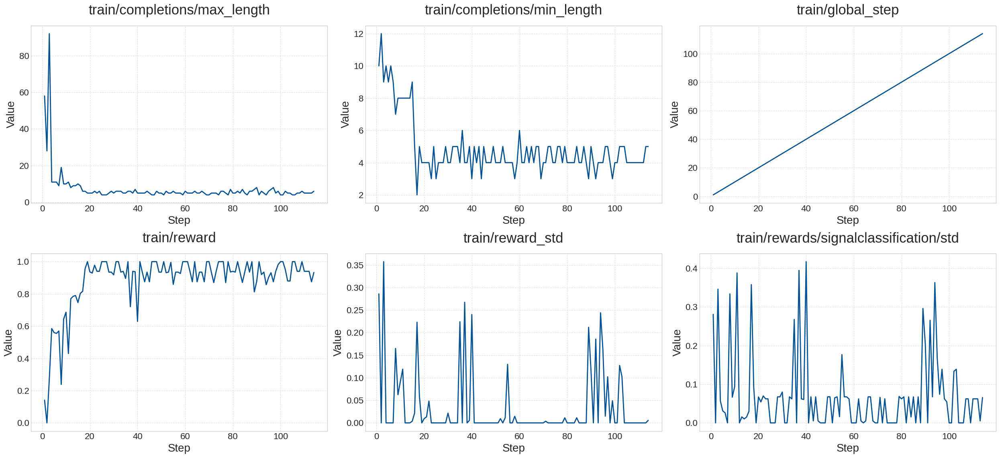

# VSLLaVA: A Pipeline for Large Multimodal Foundation Models in Industrial Vibration Signal Analysis

[← Back to Homepage](../README.md)

## Overview

VSLLaVA is a vibration-signal-oriented large multimodal model adaptation pipeline for industrial signal analysis and Prognostics and Health Management (PHM).

It formulates vibration signal interpretation as a multimodal question-answering task, enabling large vision-language models to perform signal type identification, signal parameter analysis, and explanatory diagnostic response generation through a natural-language interface.

This work represents my early exploration of connecting physical vibration signals with large multimodal foundation models through signal visualization, expert-guided instruction tuning, and signal-oriented response refinement.

## Motivation

Large multimodal models provide a flexible natural-language interface for visual reasoning and interactive analysis. However, general-purpose LMMs usually lack domain-specific priors for industrial vibration signal analysis, while conventional PHM systems are often designed as task-specific pipelines with fixed labels, fixed outputs, and limited interactivity.

VSLLaVA aims to bridge this gap by converting vibration signal analysis into an expert-guided Signal-Question-Answer (SQA) format. Instead of replacing specialized diagnostic models, it provides a flexible human-in-the-loop interface that allows PHM engineers to query signal types, parameters, and diagnostic explanations through multimodal instructions.

## Method

VSLLaVA consists of four main components:

- Expert-guided Signal-Question-Answer dataset construction from simulated and real vibration signals
- LoRA-based supervised fine-tuning of multiple vision-language model backbones
- Dual-mode evaluation combining rule-based metrics and an LMM referee
- GRPO-based post-SFT refinement for more concise, stable, and label-consistent signal identification

The pipeline first converts vibration signals into visual representations and constructs multimodal SQA triplets. Different VLM backbones are then adapted through parameter-efficient supervised fine-tuning. Finally, a tailored GRPO stage is introduced to improve classification-oriented signal type identification.

## Key Contributions

- A vibration-signal-oriented LMM adaptation pipeline for industrial signal analysis
- An expert-guided Signal-Question-Answer dataset that converts vibration signal characteristics, physical principles, and diagnostic reasoning into multimodal instruction data
- LoRA-based SQA supervised fine-tuning across multiple VLM backbones
- A tailored GRPO refinement stage for signal type identification
- A dual-mode evaluation framework combining expert-designed quantitative metrics and LMM-referee evaluation
- Additional validation through text-only ablation, real-signal experiments, vision-encoder co-tuning analysis, and conventional deep learning baselines

## Key Results

### SQA-SFT Performance

SQA-based supervised fine-tuning consistently improves the signal-oriented question-answering ability of multiple VLM backbones. The adapted models show clear gains in signal type identification, parameter-oriented responses, and explanatory answer quality compared with their corresponding base models.

For example, Ovis2-8B improves from 64.29% to 80.81% in Word Recall and from 0.16 to 5.52 in CIDEr after SQA-SFT. Qwen2-VL-2B-Instruct improves from 62.66% to 73.83% in Word Recall and from 0.60 to 4.76 in CIDEr. These results show that expert-guided SQA fine-tuning helps general-purpose VLMs acquire vibration-signal-specific understanding.

The results also show that exact numerical parameter identification remains challenging. Some models achieve better semantic and textual metrics after SQA-SFT but still suffer from high Mean Relative Error, indicating that current VLMs can learn signal-related concepts more reliably than precise numerical parameter reading.

### Cross-Backbone Evaluation

The heatmap results further show that the proposed SQA-SFT strategy is not limited to a single model architecture. Multiple VLM backbones, including InternVL3, Ovis2, LLaVA-next, and Qwen2-VL, benefit from the same expert-guided signal-question-answer adaptation pipeline.

The degree of improvement differs across backbones and signal categories. Models with stronger pretrained visual-language alignment, such as Ovis2-8B and Qwen2-VL, generally achieve stronger post-SFT performance. Real-bearing signals remain more difficult than many simulated signal categories because of stronger noise, weaker visual regularity, and more complex physical patterns.

## GRPO Refinement

After SQA-SFT, VSLLaVA introduces a GRPO-based refinement stage for signal type identification. This stage is designed to improve answer conciseness, format stability, and label consistency.

The GRPO reward function incorporates domain-specific synonym matching, fuzzy matching, and exact-match bonuses. Experimental results show that GRPO further improves classification-oriented signal identification performance by encouraging the model to generate concise and mappable signal type responses.

Across the evaluated VLM backbones, SQA-SFT+GRPO consistently improves signal-type classification metrics over SQA-SFT alone. For example, InternVL3-8B improves from 79.36% to 97.50% in accuracy and from 76.99% to 97.48% in macro F1. LLaVA-next-8B improves from 77.84% to 95.27% in accuracy and from 77.77% to 97.06% in macro F1.

GRPO is therefore used as a task-specific post-SFT refinement step. Its role is to improve concise and label-consistent signal type identification rather than to claim universal improvement on all open-ended signal reasoning tasks.

## Additional Studies

### Text-Only SQA Ablation

To examine whether the improvement comes merely from exposure to signal-related QA text, VSLLaVA includes a text-only ablation using Qwen2.5 language models without signal images.

Text-only SFT improves language-level metrics, such as Word Recall and CIDEr, showing that the extracted QA text helps models learn signal-analysis terminology and answer styles. However, text-only models remain limited in signal-grounded reasoning because they cannot access the visual signal patterns. This confirms that the value of the SQA dataset lies not only in text exposure, but also in multimodal pairing between signal visualizations, expert questions, and diagnostic answers.

### Conventional Deep Learning Baselines

VSLLaVA also compares with conventional task-specific deep learning baselines, including ViT and ResNet.

These models achieve strong closed-set signal type classification performance, with Word Recall values around 91%. However, they require reformulating the SQA benchmark into separate classification and regression tasks, and they cannot directly answer arbitrary natural-language questions.

Therefore, the conventional DL baselines are interpreted as strong task-specific references rather than direct replacements for LMM-based interactive signal analysis.

### Vision-Encoder Co-Tuning

An additional ablation examines whether co-tuning the vision encoder together with language-side LoRA further improves performance.

The results show that vision-encoder co-tuning does not consistently outperform the main frozen-vision SQA-SFT setting under the current data scale and training budget. For example, Ovis2-8B with vision co-tuning obtains lower Word Recall and CIDEr than its frozen-vision SQA-SFT counterpart.

This suggests that directly adapting a natural-image-pretrained vision encoder with limited signal-oriented SQA data may introduce instability or overfitting. The main experiments therefore keep the vision encoder frozen for controlled, efficient, and comparable adaptation, while signal-specific visual pretraining remains an important future direction.

### Real-Signal JNU Experiment

To further examine real-signal robustness, VSLLaVA includes an additional experiment on the JNU bearing dataset using both raw waveform images and envelope-spectrum representations.

The results show that envelope-spectrum representations provide useful diagnostic cues for some models, but they do not uniformly outperform raw waveform representations across all VLM backbones. Some settings also produce more recognizable predictions after envelope-spectrum fine-tuning, suggesting that fault-frequency-enhanced visualization can help reduce invalid or unmappable outputs.

However, robust closed-set real-bearing-fault classification remains challenging for general-purpose VLMs. The JNU experiment highlights the need for stronger signal-specific visual representations, frequency-domain grounding, and more reliable real-signal adaptation.

## Paper and Code

- Paper: [arXiv](https://arxiv.org/abs/2409.07482)
- Code: [GitHub](https://github.com/ZXR-Rachel/VSLLaVA)
- Status: Accepted by *Advanced Engineering Informatics*

## Notes

VSLLaVA is positioned as a flexible human-in-the-loop interface for PHM engineers. It complements rather than replaces specialized task-specific diagnostic models.

Its main contribution lies in adapting large multimodal models to vibration-signal-oriented question answering, enabling natural-language interaction with industrial signal analysis tasks. The additional ablation, baseline, co-tuning, and real-signal studies further show both the potential and current limitations of using general-purpose VLMs for physical signal understanding.